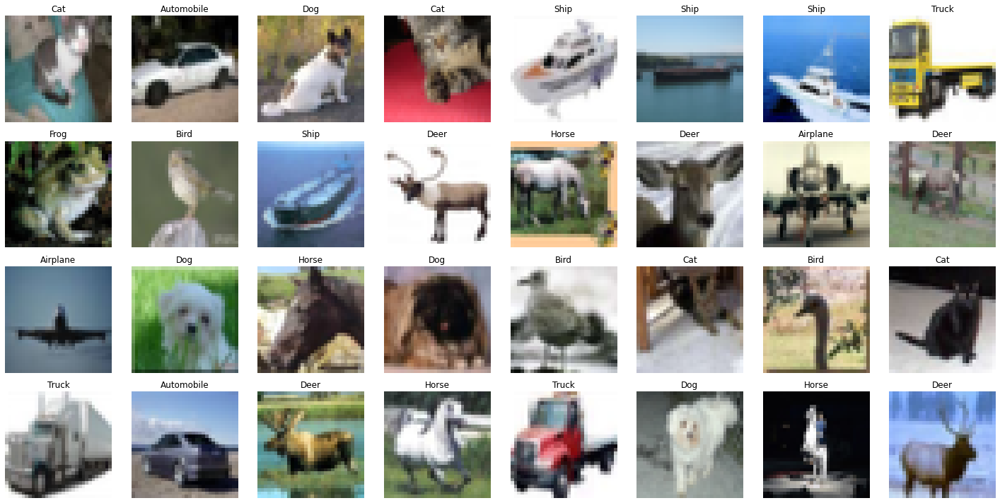
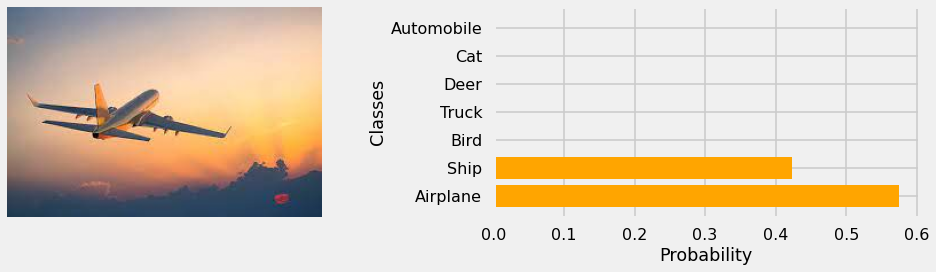
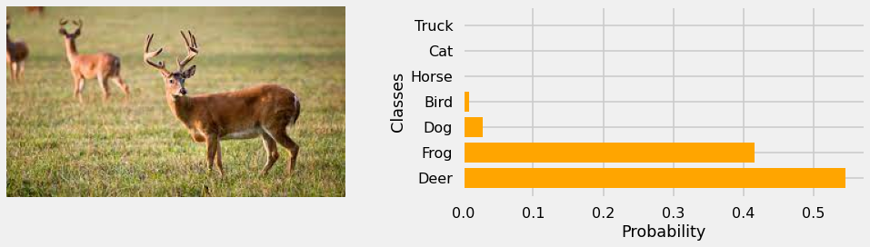
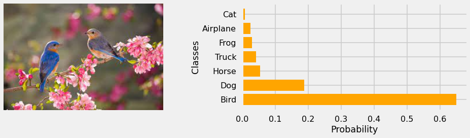
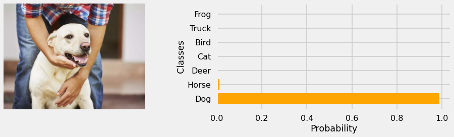
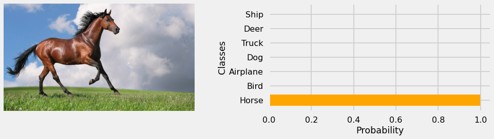
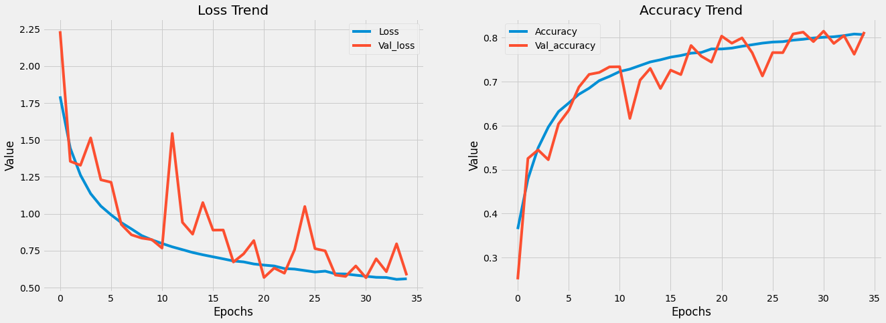

# CIFAR 10 Image Classification

In this notebook, I am going to classify images from the CIFAR-10 dataset. The dataset consists of airplanes, dogs, cats, and other objects. You'll preprocess the images, then train a convolutional neural network on all the samples. The dataset can downloaded by clicking [here](https://www.cs.toronto.edu/~kriz/cifar-10-python.tar.gz)

## The Dataset

The CIFAR-10 dataset consists of 60000 32x32 colour images in 10 classes, with 6000 images per class. There are 50000 training images and 10000 test images.
The dataset is divided into five training batches and one test batch, each with 10000 images. The test batch contains exactly 1000 randomly-selected images from each class. The training batches contain the remaining images in random order, but some training batches may contain more images from one class than another. Between them, the training batches contain exactly 5000 images from each class.

The classes are completely mutually exclusive. There is no overlap between automobiles and trucks. "Automobile" includes sedans, SUVs, things of that sort. "Truck" includes only big trucks. Neither includes pickup trucks.

## Predictions

## Final Testing Results

    Test Loss: 0.5822
    Test Accuracy: 81.330 %

## Model Loss and Accuracy

## Dependencies

- Jupyter Notebook v6.4.8
- Python v3.9.7
- Tensorflow v2.9.1
- Keras v2.9.0
- Numpy v1.22.2
- Pandas v1.4.2
- Matplotlib v3.2.2